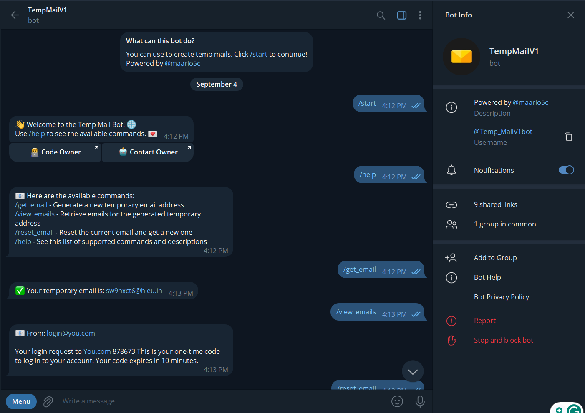

# Temp Mail Bot

A Python-based Telegram bot to generate and manage temporary email addresses, retrieve emails, and perform various email-related tasks.



Demo Bot: [Temp Mail Bot](https://t.me/Temp_MailV1bot)

## Features

- Generate temporary email addresses
- Retrieve emails for the generated temporary address
- Reset the current email and get a new one
- Highlight verification codes in email content
- Contextual help for available commands
- Start command with interactive buttons
- Owner gets notified when new users start the bot

## Requirements

- Python 3.8 or higher
- Telegram Bot API token
- Temp Mail API key

## Installation

1. **Clone the repository:**
   ```sh
   git clone https://github.com/hexguard/TempMailV1.git
   cd TempMailV1

2. **Set the required environment variables:**
   ```sh
      BOT_TOKEN=your-telegram-bot-token
      API_KEY=your-temp-mail-api-key
      GROUP_CHAT_ID=your-group-chat-id-to-receive-notifications
   ```

### Installation using Python

1. **Create a virtual environment:**
   ```sh
      python -m venv venv
   ```

2. **Activate the virtual environment:**  
   On Windows:
   ```sh
   .\venv\Scripts\activate
   ```
   On macOS and Linux:
   ```sh
   source venv/bin/activate
   ```

5. **Install the required packages:**  
   ```sh
   pip install -r requirements.txt
   ```
6. **Run the bot:**  
   ```sh
   python main.py
   ```

### Installation using Docker
   ```sh
   docker compose up -d
   ```


## Available Commands
```sh
/start - Start the bot and see a welcome message with buttons.
/get_email - Generate a new temporary email address.
/get_mails - Retrieve emails for the generated temporary address.
/change_email - Change and get a new temporary email.
/reset_email - Reset the current email and get a new one.
/help - See the list of supported commands and descriptions.
```

Contact me on telegram @maario5c